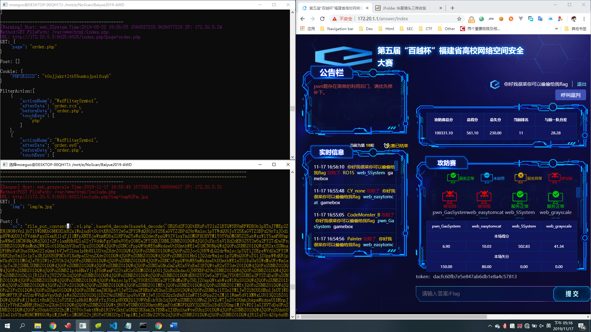

# CellWaf
## 描述
本项目是一款简单,<ruby>智<rp>(<rp><rt>粗</rt><rp>)</rp>&nbsp;能<rp>(</rp><rt>&nbsp;暴</rt><rp>)</rp></ruby>为PHP架设保姆级WEB防火墙,适用于国内高校赛CTF比赛中AWD环节,提供日志审查、抓取payload、过滤未知威胁操作,误杀率较低,**本waf不会die掉任何请求只会自动替换掉敏感请求数据**.并配备监控脚本用于查看当前受攻击情况.
## 特性
* mysql注入过滤✔
* 实时监控客户端✔
* 过滤未知攻击参数✔
* 拦截带有flag标识的访问✔
* 请求数据dump✔
* 调用文件栈输出✔
* 记录过滤事件溯源✔
* 支持namespace✔
* 遍历反解与过滤base64编码的payload✔
## 目录结构
```
│  README.md //说明文件
│  waf_WatchDog.exe //Window监控脚本客户端
│  waf_WatchDog.py //python监控脚本源码
│  
└─Upload //上传目录
        filter.php //过滤文件
        lib.php //防火墙核心库
        waf.php //入口文件
        waf_config.php //配置文件
        protect.sh //一键部署脚本
```
## 使用方法
### 服务端
* 备份: ```./protect.sh /var/www/html gameboxname backup ```
* 设置waf: ```./protect.sh /var/www/html gameboxname setwaf ```
* 还原: ```./protect.sh /var/www/html gameboxname reload ```
### 监控端
* 启动监听 ```./waf_WatchDog.py Gamebox1 http://172.17.0.2/ hRwNxiAPJaJIJUHUKbN3Q5awoMn90WQ6```
## 效果


- gamebox3 gamebox4均为PHP环境

## 结语
如果你对本项目十分感兴趣请Star,Follow,如果有问题或能有bypass的地方请提出issue
